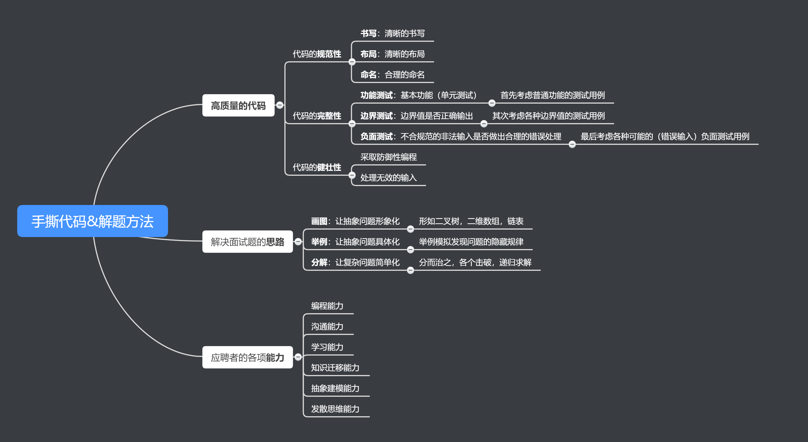
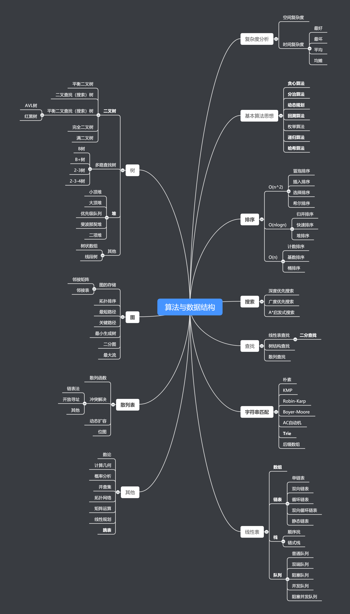

### 分类列表

清单来自于[https://www.educative.io/courses/grokking-the-coding-interview](https://www.educative.io/courses/grokking-the-coding-interview)

#### 01. 滑动窗口 (Pattern: Sliding Window)
#### 02. 双指针 (Pattern: Two Pointers)
#### 03. 快慢指针 (Pattern: Fast & Slow pointers)
#### 04. 区间合并 (Pattern: Merge Intervals)
#### 05. 循环排序 (Pattern: Cyclic Sort)
#### 06. 链表反转 (Pattern: In-place Reversal of a LinkedList)
#### 07. 广度优先 (Pattern: Tree Breadth First Search)
#### 08. 深度优先 (Pattern: Tree Depth First Search)
#### 09. 双堆 (Pattern: Two Heaps)
#### 10. 子集 (Pattern: Subsets)
#### 11. 二分搜索 (Pattern: Modified Binary Search)
#### 12. 按位异或 (Pattern: Bitwise XOR)
#### 13. Top K 元素 (Pattern: Top 'K' Elements)
#### 14. 多路归并 (Pattern: K-way merge)
#### 15. 动态规划 (Pattern : 0/1 Knapsack (Dynamic Programming))
#### 16. 拓扑排序 (Pattern: Topological Sort (Graph))
#### 17. 杂项 (Miscellaneous)

### 思维导图

