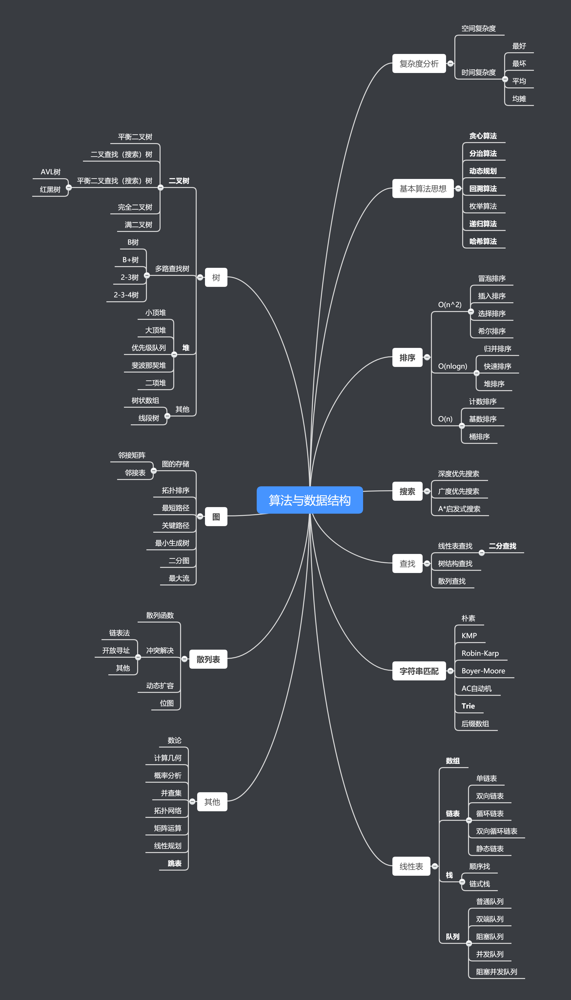

#data-structure-and-PAT

- What：什么是数据结构？

  - 数据结构——数据的储存方式

  - 算法——操作数据的方法

- Why：为什么要学算法和数据结构？
  > 程序=算法+数据结构

  万物之根本在于根基，算法与数据结构是进入计算机行业的入场券

- How：如何学？学什么？
  - 复杂度分析（内功心法——!important）
  - 数据结构：
    - 数组
    - 链表
    - 栈
    - 队列
    - 散列表
    - 二叉树
    - 堆
    - 跳表
    - 图
    - Trie树
  - 算法：
    - 递归
    - 排序
    - 二分查找
    - 搜索
    - 哈希算法
    - 贪心算法
    - 分治算法
    - 回溯算法
    - 动态规划
    - 字符串匹配算法
  - 来历（是什么）
  - 自身的特点
  - 适合解决的问题
  - 实际应用的场景
  - 边学边练，一定要手写代码，一定要敲代码
  - 尝试用不同的语言解决问题
  - 尝试用不同的思路方法解决问题

- 步骤

  1.入门

  2.基础

  3.高级

  4.实战

思维导图：

>​					

